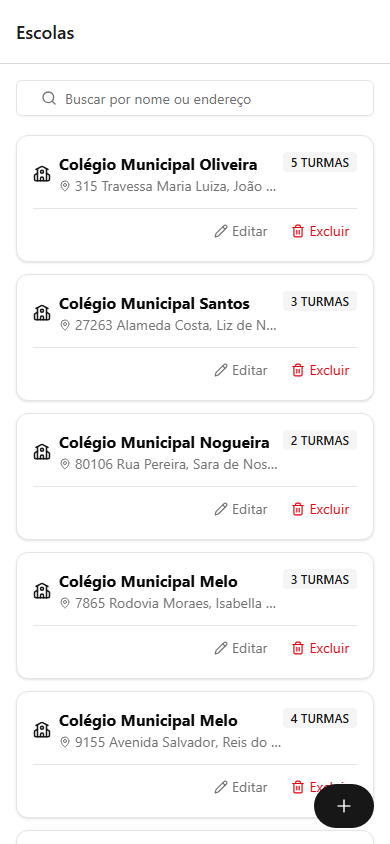
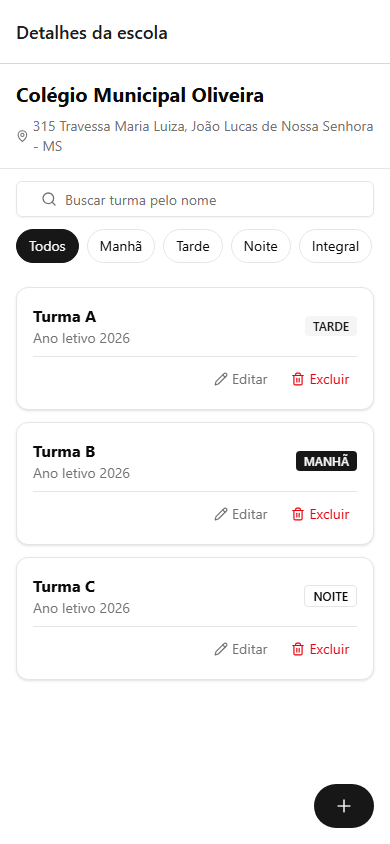

# Gestão de Escolas Públicas

Aplicativo mobile (Expo/React Native) para uma prefeitura cadastrar e listar escolas públicas e as turmas de cada escola, substituindo o controle manual em planilhas.

Desenvolvido como resposta ao desafio técnico [`🧩 Desafio Técnico – React Native (Expo).md`](<./🧩 Desafio Técnico – React Native (Expo).md>).

## Stack e versões utilizadas

| Item | Versão |
|---|---|
| Node.js | 20.19.4 |
| Expo SDK | 57 |
| React | 19.2.3 |
| React Native | 0.86.3 |
| TypeScript | 6.0.3 |
| Navegação | Expo Router 6 (`expo-router` ~57) |
| UI | gluestack-ui v5 + NativeWind v5 (Tailwind CSS v4) |
| Estado | Zustand 5 (com persistência via AsyncStorage) |
| Formulários | react-hook-form + zod |
| Mock de backend | MirageJS |
| Testes | Jest (`jest-expo`) + Testing Library React Native |

> O desafio pedia Expo SDK 54+ / React 19 / RN 0.81+ — o projeto foi criado com as versões estáveis mais recentes disponíveis no momento (SDK 57), que atendem "ou superior" com folga.

## Funcionalidades

**Escolas** — listar (nome, endereço, nº de turmas), cadastrar, editar e excluir (com confirmação; exclui também as turmas vinculadas).

**Turmas** — listar as turmas de uma escola, cadastrar, editar e excluir (nome, turno, ano letivo).

**Extras implementados** — busca por nome/endereço (escolas) e por nome (turmas); filtro por turno; layout responsivo (1 coluna no celular, 2 em tablet/paisagem); componentização e hooks customizados; armazenamento offline (AsyncStorage); testes unitários e de integração.

## Como instalar e rodar

### Pré-requisitos

- **Node.js ≥ 20.19.4** (o Expo SDK 57 exige essa versão mínima — se estiver em uma versão mais antiga, use [nvm](https://github.com/nvm-sh/nvm) ou [nvm-windows](https://github.com/coreybutler/nvm-windows): `nvm install 20.19.4 && nvm use 20.19.4`)
- npm (vem com o Node)
- Para testar no celular: o app **[Expo Go](https://expo.dev/go)** (Android/iOS) — não precisa de emulador nem de build nativo

### Passos

```bash
npm install
npx expo start
```

O terminal mostra um QR code: escaneie com o app Expo Go (Android) ou com a câmera (iOS) para abrir o app no celular, na mesma rede Wi-Fi do computador.

Também é possível rodar:

```bash
npm run web       # abre no navegador (npx expo start --web)
npm run android   # requer Android Studio/emulador configurado
npm run ios       # requer macOS + Xcode
```

### Scripts disponíveis

| Comando | O que faz |
|---|---|
| `npm start` | Inicia o Metro/Expo (QR code para Expo Go) |
| `npm run web` | Abre a versão web no navegador |
| `npm run lint` | ESLint (`eslint-config-expo` + Prettier) |
| `npm run format` | Formata o projeto com Prettier |
| `npm run typecheck` | `tsc --noEmit` |
| `npm test` | Roda a suíte de testes (Jest) |

## Como o mock de backend funciona

Não existe nenhum servidor real: o [MirageJS](https://miragejs.com/) intercepta as chamadas `fetch` do próprio app e responde como se fosse uma API de verdade, com banco de dados em memória, latência simulada e validação de campos obrigatórios. Ele sobe automaticamente sempre que o app roda em modo desenvolvimento (`__DEV__`) — não há nenhum passo manual, nenhum servidor para iniciar à parte.

Endpoints simulados (`src/mocks/`):

- `GET /schools` — lista escolas, cada uma já com o array `turmas` embutido
- `GET/POST/PUT/DELETE /schools/:id` — CRUD de escola (`DELETE` remove também as turmas da escola)
- `GET /classes?schoolId=` — turmas de uma escola
- `GET/POST/PUT/DELETE /classes/:id` — CRUD de turma

Ao abrir o app pela primeira vez, o banco simulado já vem populado com ~6 escolas e algumas turmas cada (`src/mocks/seeds.ts`), com nomes/endereços gerados via `@faker-js/faker` (localizado em pt-BR).

## Arquitetura

Organização por *feature* (não por tipo de arquivo), para cada domínio (escolas, turmas) carregar junto seus próprios tipos, API, estado e componentes:

```
app/                            # Rotas (Expo Router)
  _layout.tsx                   # Providers + bootstrap do mock em __DEV__
  schools/
    index.tsx                   # Lista de escolas
    new.tsx                     # Criar escola (modal)
    [id]/
      index.tsx                 # Detalhe da escola + lista de turmas
      edit.tsx                  # Editar escola (modal)
      classes/
        new.tsx                 # Criar turma (modal)
        [classId]/edit.tsx      # Editar turma (modal)

src/
  features/
    schools/    { types.ts, schema.ts, api/, store/, hooks/, components/ }
    classes/    { types.ts, schema.ts, api/, store/, hooks/, components/ }
  mocks/        # Servidor MirageJS: models, factories, seeds, rotas
  services/http/# httpClient (Adapter sobre o fetch)
  components/   # Componentes compartilhados entre features
  hooks/        # Hooks compartilhados (debounce, breakpoint, navegação)

components/ui/  # Componentes gerados pelo CLI do gluestack-ui (vendorizado)
```

### Padrões de projeto usados

- **Adapter** — [`src/services/http/httpClient.ts`](src/services/http/httpClient.ts) normaliza o `fetch` nativo (erros tipados via `ApiError`, JSON, base URL) numa interface única. Trocar o mock por uma API real não muda nada fora dessa camada.
- **Repository** — [`schoolsRepository.ts`](src/features/schools/api/schoolsRepository.ts) e [`classesRepository.ts`](src/features/classes/api/classesRepository.ts) definem uma interface (`SchoolsRepository`/`ClassesRepository`) e uma implementação HTTP contra o mock. As stores dependem só da interface.
- **Factory** — as *factories* do MirageJS (`src/mocks/factories.ts`) geram os dados simulados; e funções como `createEmptySchoolInput()`/`createEmptyClassInput()` (em cada `types.ts`) centralizam os valores padrão de um formulário em branco.

### Por que essas escolhas

- **Zustand + persist(AsyncStorage)** em vez de Context API: menos boilerplate para múltiplas ações assíncronas (criar/editar/excluir) e a persistência offline sai de graça (`partialize` guarda só os dados, não o estado transitório de loading/erro).
- **MirageJS em vez de MSW**: no React Native não existe Service Worker; o Mirage intercepta o `fetch`/`XMLHttpRequest` diretamente, o que funciona de forma mais direta no ambiente RN.
- **react-hook-form + zod**: validação tipada de ponta a ponta (o schema zod também define o tipo TypeScript do formulário via `z.infer`), com mensagens de erro por campo e reaproveitamento do erro 422 vindo do "servidor".
- **`components/ui/`** foi gerado pelo CLI oficial do gluestack-ui (`npx gluestack-ui add --all`) e é tratado como código vendorizado (fora do lint/typecheck de código próprio), da mesma forma que um projeto shadcn/ui trata sua pasta de componentes copiados.

## Testes

```bash
npm test
```

19 testes em 5 suítes, cobrindo:

- **Integração do backend simulado** ([`src/mocks/server.test.ts`](src/mocks/server.test.ts)) — sobe um servidor Mirage real e testa list/create/update/delete de escolas e turmas, validação 422, exclusão em cascata e o seed de desenvolvimento, passando pela stack completa (repository → adapter → fetch → Mirage).
- **Stores Zustand** ([`useSchoolsStore.test.ts`](src/features/schools/store/useSchoolsStore.test.ts), [`useClassesStore.test.ts`](src/features/classes/store/useClassesStore.test.ts)) — create/update/delete e os seletores de busca/filtro, com o repository mockado.
- **Hook customizado** ([`useDebouncedValue.test.ts`](src/hooks/useDebouncedValue.test.ts)) — comportamento do debounce com fake timers.
- **Formulário** ([`SchoolForm.test.tsx`](src/features/schools/components/SchoolForm.test.tsx)) — validação exibida na UI e submissão com Testing Library React Native.

## Decisões técnicas e limitações conhecidas

- **`components/ui/` tem mais componentes do que o app usa.** O CLI do gluestack-ui foi rodado com `--all` (58 componentes) para evitar ter que acertar o nome exato de cada um na hora de instalar; só uma parte deles é de fato importada pelo app (Button, Input, Select, Card, Badge, FormControl, AlertDialog, Fab, Spinner, etc.) — o Metro não inclui no bundle final o que não é importado.
- **gluestack-ui v5 ainda é recente** (a própria CLI se identifica como "v5 alpha" em alguns textos, mesmo a versão publicada como `latest` no npm). Alguns arquivos vendorizados têm erros de tipagem do próprio upstream (não afetam o app rodando) — foram marcados com `@ts-nocheck` e um comentário explicando o motivo, em vez de mexer no código gerado.
- Sem Android SDK/Xcode disponíveis durante o desenvolvimento, a verificação foi feita via `tsc --noEmit`, `eslint`, `jest`, `npx expo export -p web` (build de produção completo) e a versão web do app dirigida ponta a ponta por um navegador headless (Playwright), navegando por cada tela e ação como um usuário real faria. Isso pegou dois bugs que passariam despercebidos só com testes automatizados/typecheck: um loop infinito de re-render ao aplicar busca/filtro (seletor do Zustand sem `useShallow`) e o `passthrough()` do MirageJS só liberando requisições para o próprio host do mock. Ambos corrigidos. O caminho recomendado para testar de fato num dispositivo é o Expo Go num celular real (`npx expo start`).

## Prints

| Lista de escolas | Nova escola | Detalhe + turmas | Nova turma |
|---|---|---|---|
|  |  |  |  |
